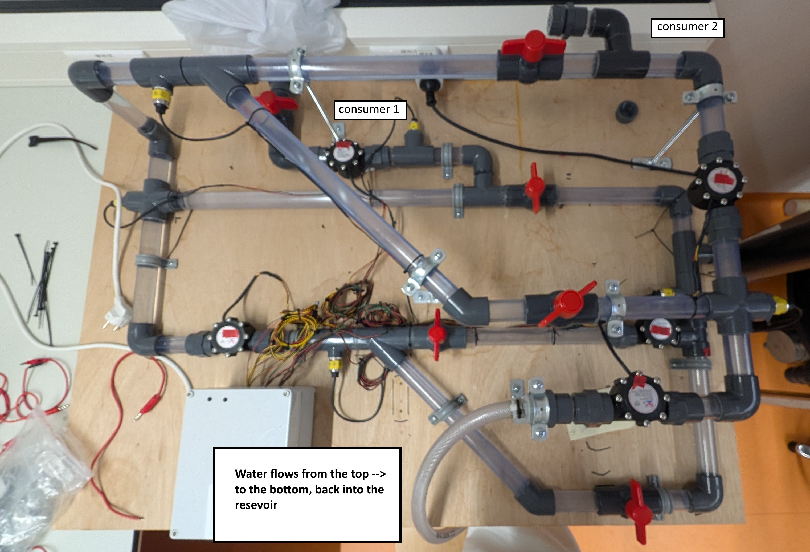

# WDN neural network


The epanet model currently contains:
- 16 pipes
- 21 junctions
- 2 consumers
- 7 valves

## Dataset
The dataset is generated by DatasetGenerator.
This will by default create a dataset of 234280 simulations.
The dataset consist of two parts:
1. Every combination of a list of valve settings and demand settings (224280 entries)
2. Random settings for each valve and demand node 
### Valves
The valves are of the TCV type. For the first part they can be set to to the following values:

```python 
self.valve_setting_options = [0.01, 0.2, 1.0, 8, 50, 'closed'] 
````

For the second value they can be set to any value between 0.01 and 50. This value is determined by first selecting a value from the `valve_setting_options`. Then it will pick a random number between this value and the next value in the `valve_setting_options`, using a uniform distribution.

### Demand
The consumer is currently only node 27.
For the first part the demand can be set to the following values:

```python
self.base_demand_values = [0.0, 0.3, 0.6, 0.9, 1.2]
```
For the second part it will pick a random number between 0.0 and 1.2 using a uniform distribution.
### Format
The output is a csv file with the following header:

```python
    self.csv_header = [
        "valve_19", "valve_22", "valve_16", "valve_27", "valve_31", "valve_39",
        "node_27",
        "flow_35","flow_33","flow_5","flow_18","flow_9",
        "pressure_22","pressure_15","pressure_4","pressure_3","pressure_8"]
```

## Neural network
- Feed forward neural network
- the  4 flow and 4 pressure sensors as inputs
- output at first consumer 1 (2 nodes: 1 for pressure and 1 for flow)
- 2 middle layers have 512 nodes each

### results


## Running Locally
Make sure you have Python >= 3.6 installed on your system.

To run the project locally, follow these steps:

1. Clone the repository:
    ```bash
    git clone https://github.com/your-repo/water-network-simulation.git
    cd water-network-simulation
    ```

2. Install the required dependencies:
    ```bash
    pip install -r requirements.txt
    ```

3. Create the dataset
    ```bash
    python DatasetGenerator.py ./networks/tabletopmodel.inp
    ```
4. Train the model by modifying train_model:
    ```python
    file_name = 'REPLACE_WITH_THE_RIGHT_DATASET'
    ```
    and run it with:
    ```bash
    python train_model.py
    ```

